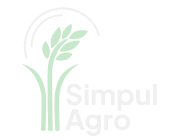

<div align="center">
  
  <h1>SimpulAgro Mobile</h1>
  <p>Aplikasi mobile untuk monitoring pertanian berbasis IoT, analisis agronomi, dan pengelolaan operasional budidaya.</p>

  <p>
    =3.32.0">
    =3.8.1 and <4.0.0">
    
  </p>
</div>

## Daftar Isi

- [Tentang Aplikasi](#tentang-aplikasi)
- [Tampilan Aplikasi](#tampilan-aplikasi)
- [Kapabilitas Utama](#kapabilitas-utama)
- [Terminologi Domain](#terminologi-domain)
- [Teknologi](#teknologi)
- [Arsitektur](#arsitektur)
- [Persyaratan](#persyaratan)
- [Instalasi](#instalasi)
- [Konfigurasi Environment](#konfigurasi-environment)
- [Verifikasi Kualitas](#verifikasi-kualitas)
- [Build Release Android](#build-release-android)
- [Keamanan](#keamanan)
- [Dokumentasi dan Referensi](#dokumentasi-dan-referensi)

## Tentang Aplikasi

SimpulAgro Mobile menghubungkan data perangkat IoT, sensor pertanian, siklus tanam, tugas lapangan, dan rekomendasi berbasis data dalam satu aplikasi. Aplikasi menggunakan REST API SimpulAgro sebagai sumber data utama dan menyediakan pengalaman yang disesuaikan untuk pengguna operasional maupun administrator.

## Tampilan Aplikasi

<div align="center">
  <a href="https://github.com/ahmdhqnn/simpulagromobile/blob/973a77fd421c5260e45214ac0d567882c6786955/images.svg">
    
  </a>
  <br>
  <sub>Capture antarmuka SimpulAgro Mobile. Klik gambar untuk membuka berkas sumber.</sub>
</div>

## Kapabilitas Utama

- **Autentikasi dan sesi**: login, access token dan refresh token, silent refresh, serta penanganan sesi kedaluwarsa.
- **Dashboard**: kesehatan lingkungan, parameter sensor, rekap harian, rekomendasi, aktivitas terbaru, catatan, dan ringkasan operasional.
- **Monitoring IoT**: data realtime, riwayat, rekap harian, rekap bulanan, peta perangkat, analitik, dan koreksi data khusus admin.
- **Perangkat dan sensor**: pengelolaan site, perangkat, sensor fisik, pemetaan parameter sensor, satuan, status, dan nilai ambang.
- **Tanaman dan fase pertumbuhan**: pengelolaan masa tanam, HST, fase pertumbuhan, GDD, serta proses panen.
- **Indikator agro**: Environmental Health, VDP, GDD, ETC, dan rincian parameter pendukung.
- **Rekomendasi**: rekomendasi NPK, kondisi lingkungan, tanaman, dan tindak lanjut berdasarkan data backend/ML.
- **Tugas lapangan**: pembuatan, penjadwalan, pemantauan status, dan penyelesaian tugas.
- **Kolaborasi**: forum, komentar, reaksi, catatan site, undangan anggota, dan notifikasi dalam aplikasi.
- **Administrasi**: pengelolaan user, role, permission, site, unit, tanaman, perangkat, sensor, dan device-sensor.
- **Lokalisasi**: Bahasa Indonesia dan Bahasa Inggris dengan format tanggal yang mengikuti locale.

## Terminologi Domain

Istilah berikut digunakan secara konsisten di aplikasi:

| Istilah          | Identifier | Arti                                                                            |
| ---------------- | ---------- | ------------------------------------------------------------------------------- |
| Device           | `dev_id`   | Perangkat/gateway IoT yang terdaftar pada site.                                 |
| Sensor           | `sens_id`  | Modul sensor fisik yang terhubung ke device.                                    |
| Parameter sensor | `ds_id`    | Kanal pengukuran, misalnya suhu, kelembapan, pH, nitrogen, fosfor, atau kalium. |

Jumlah parameter yang dipantau dapat lebih besar daripada jumlah sensor fisik karena satu sensor dapat menghasilkan beberapa parameter pengukuran.

## Teknologi

| Area                      | Teknologi                               |
| ------------------------- | --------------------------------------- |
| Framework                 | Flutter, Dart                           |
| State management          | Riverpod, Riverpod Generator            |
| Navigasi                  | GoRouter                                |
| HTTP client               | Dio                                     |
| Penyimpanan aman          | Flutter Secure Storage                  |
| Preferensi lokal          | Shared Preferences                      |
| Model dan serialisasi     | Freezed, JSON Serializable              |
| Functional error handling | Dartz                                   |
| Visualisasi               | FL Chart, Percent Indicator             |
| Lokalisasi                | Flutter Localizations, Intl, ARB        |
| UI assets                 | Flutter SVG, Plus Jakarta Sans, Shimmer |
| Testing                   | Flutter Test, Mocktail                  |

Versi dependency yang digunakan sebagai sumber kebenaran tersedia di [pubspec.yaml](pubspec.yaml) dan [pubspec.lock](pubspec.lock).

## Arsitektur

Proyek menggunakan pendekatan **feature-first Clean Architecture**. Setiap fitur memisahkan tanggung jawab menjadi presentation, domain, dan data.

```text
Presentation
  Screens, widgets, providers, UI state
       |
       v
Domain
  Entities, repository contracts, use cases
       |
       v
Data
  Models, datasources, repository implementations
       |
       v
REST API / Secure Storage / Local Preferences
```

Komponen lintas fitur ditempatkan pada:

- `lib/core`: konfigurasi, networking, autentikasi, storage, router, theme, dan utility.
- `lib/shared`: widget dan komponen UI yang dapat digunakan ulang.
- `lib/l10n`: resource ARB dan class lokalisasi hasil generator.

## Struktur Proyek

```text
simpulagromobile/
|-- android/                    # Konfigurasi dan build Android
|-- ios/                        # Konfigurasi dan build iOS
|-- assets/                     # Icon, gambar, dan font
|-- lib/
|   |-- core/                   # Infrastruktur aplikasi
|   |-- features/               # Modul fitur berbasis domain
|   |-- l10n/                   # Lokalisasi Indonesia dan Inggris
|   |-- shared/                 # Komponen bersama
|   |-- app.dart                # Root MaterialApp
|   `-- main.dart               # Entry point dan bootstrap
|-- test/                       # Unit, widget, contract, dan scenario tests
|-- l10n.yaml                   # Konfigurasi generator lokalisasi
`-- pubspec.yaml                # Metadata, dependency, dan assets
```

## Persyaratan

- Flutter SDK `>=3.32.0` pada channel stable.
- Dart SDK `>=3.8.1 <4.0.0`.
- Android Studio atau VS Code dengan Flutter extension.
- Android SDK dan JDK 17 untuk build Android.
- Xcode dan CocoaPods pada macOS untuk build iOS.
- Backend SimpulAgro yang dapat diakses dari perangkat atau emulator.

Validasi environment lokal dengan:

```bash
flutter doctor -v
```

## Instalasi

```bash
git clone https://github.com/ahmdhqnn/simpulagromobile.git
cd simpulagromobile
flutter pub get
```

Jalankan aplikasi dengan konfigurasi API yang sesuai:

```bash
flutter run --dart-define=APP_ENV=development --dart-define=API_BASE_URL=http://10.0.2.2:3000/api
```

`10.0.2.2` mengarah ke host machine dari Android Emulator. Untuk perangkat fisik, gunakan alamat IP LAN host yang dapat dijangkau perangkat.

## Konfigurasi Environment

Konfigurasi dibaca saat compile melalui `--dart-define` dan didefinisikan pada [app_environment.dart](lib/core/config/app_environment.dart).

| Variable       | Nilai                                  | Keterangan                                           |
| -------------- | -------------------------------------- | ---------------------------------------------------- |
| `APP_ENV`      | `development`, `staging`, `production` | Menentukan environment aktif. Default: `production`. |
| `API_BASE_URL` | URL absolut                            | Mengganti base URL bawaan untuk environment aktif.   |

Contoh staging:

```bash
flutter run --dart-define=APP_ENV=staging --dart-define=API_BASE_URL=https://staging-api.example.com/api
```

Contoh production:

```bash
flutter build appbundle --release --dart-define=APP_ENV=production --dart-define=API_BASE_URL=https://api.example.com/api
```

Ketentuan base URL:

- Gunakan URL yang menyertakan prefix API, misalnya `/api`.
- Trailing slash akan dinormalisasi oleh aplikasi.
- Gunakan HTTPS untuk distribusi production.
- Jangan menyimpan token, password, atau secret di `--dart-define` maupun source code.

## Code Generation dan Lokalisasi

Jalankan generator setelah mengubah class beranotasi Freezed, JSON Serializable, atau Riverpod:

```bash
dart run build_runner build --delete-conflicting-outputs
```

Setelah mengubah file ARB pada `lib/l10n`:

```bash
flutter gen-l10n
```

File sumber bahasa:

- `lib/l10n/app_id.arb`
- `lib/l10n/app_en.arb`

## Verifikasi Kualitas

Gunakan rangkaian pemeriksaan berikut sebelum membuat artefak release:

```bash
dart format --output=none --set-exit-if-changed lib test
flutter analyze
flutter test
```

Menjalankan test dengan laporan coverage:

```bash
flutter test --coverage
```

Test suite mencakup contract API, parsing response, repository, provider, autentikasi, storage, arsitektur, widget, dan skenario utama aplikasi.

## Build Release Android

### 1. Konfigurasi signing

Salin `android/key.properties.example` menjadi `android/key.properties`, lalu isi credential keystore yang valid:

```properties
storePassword=<store-password>
keyPassword=<key-password>
keyAlias=<key-alias>
storeFile=../release-keystore.jks
```

Simpan keystore pada lokasi yang sesuai dengan `storeFile`. File `android/key.properties`, `*.jks`, dan `*.keystore` tidak boleh dimasukkan ke version control.

Build release Android sengaja dihentikan apabila signing belum dikonfigurasi.

### 2. Buat artefak

Android App Bundle untuk distribusi Play Store:

```bash
flutter build appbundle --release --dart-define=APP_ENV=production --dart-define=API_BASE_URL=https://api.example.com/api
```

APK release untuk distribusi langsung:

```bash
flutter build apk --release --dart-define=APP_ENV=production --dart-define=API_BASE_URL=https://api.example.com/api
```

Artefak build tersedia di direktori `build/app/outputs`.

## Keamanan

- Access token dan refresh token disimpan menggunakan Flutter Secure Storage.
- Request terautentikasi menggunakan Bearer token melalui interceptor Dio.
- Aplikasi melakukan proactive token refresh dan menangani respons `401` secara terpusat.
- Akses fitur admin dibatasi berdasarkan role dan permission dari backend.
- Request paralel dibatasi untuk menjaga stabilitas backend.
- Retry otomatis hanya diterapkan pada operasi baca yang aman dan error jaringan tertentu.
- Credential, signing key, token, dan data sensitif tidak boleh disimpan di repository.
- Konfigurasi Android saat ini mengizinkan cleartext HTTP hanya untuk host backend yang ditentukan. Distribusi production sebaiknya menggunakan HTTPS dan network security policy yang lebih ketat.

Validasi authorization tetap wajib dilakukan di backend. Pemeriksaan role/permission pada aplikasi hanya berfungsi sebagai kontrol antarmuka dan tidak menggantikan keamanan server.

## Dokumentasi dan Referensi

- [Swagger API Documentation](http://202.10.37.32/api-docs/) - kontrak endpoint dan referensi REST API SimpulAgro.
- [Supabase](https://ykawrhdepnrudceydsbd.supabase.co) - layanan backend dan database proyek.
- [Rastek.Agro - Figma](https://www.figma.com/design/MLzIlZGouhVLO7hCSS8pn8/Rastek.Agro?node-id=1-2&t=jdQyMjDO8mVZSn04-1) - desain dan referensi antarmuka aplikasi.

## Pemeliharaan

Saat melakukan perubahan setelah release:

1. Pertahankan batas dependency antara presentation, domain, dan data.
2. Gunakan endpoint dan parser terstruktur sesuai kontrak backend.
3. Tambahkan atau perbarui test sesuai risiko perubahan.
4. Regenerasi source code dan lokalisasi bila sumbernya berubah.
5. Jalankan seluruh quality gates sebelum membuat artefak release baru.
6. Perbarui `version` pada `pubspec.yaml` mengikuti format `major.minor.patch+build`.

## Lisensi dan Distribusi

Repository ini tidak mendeklarasikan lisensi open-source. Penggunaan, modifikasi, dan distribusi mengikuti kebijakan pemilik proyek.
